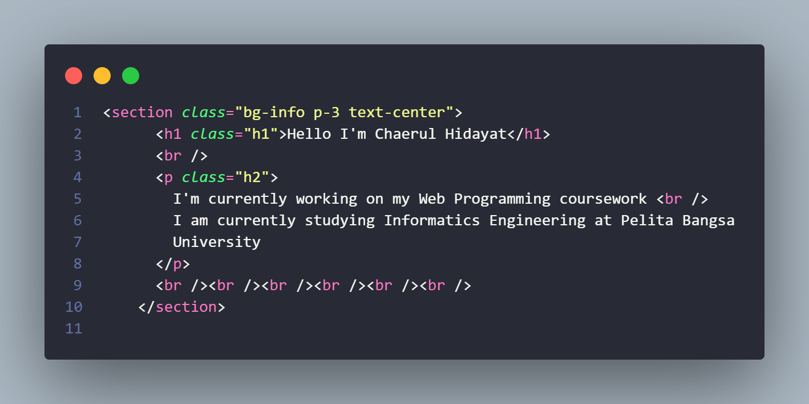

# HTML - CSS - BOOSTRAP

=========================================================================== 

&#128640 <b>NAMA : CHAERUL HIDAYAT</b>&#128640  
&#128640<b>NIM : 312210300</b>&#128640  
&#128640<b>Mata Kuliah : Pemrograman Web</b>&#128640  

===========================================================================  

# 1. Saya menggunskan Boostrap versi 4.5.2  

   

# 2. Saya membuat layout dan nav link  

  
Dan ini hasil nya  
  

# 3. Saya membuat isi Hello World  

  
Dan ini hasil nya  
  

# 4. Saya membuat article circle  

  
Dan ini hasil nya  
  

# 5. Saya Membuat Widget Header  

   
Dan ini hasil nya  
  

# 6. Saya membuat article box  

   
Dan ini hasil nya  
  

# 7. Saya membuat footer  

  
Dan ini hasil nya  
  
   

# Di sini saya akan membuat halaman About  

# 1. Saya menggunakan Boostrapm Versi 5.3.2  

  

# 2. Saya membuat header dengan isi About Us  

  
Dan ini hasil nya  
  

# 3. Saya membuat header dan paragraf  

  
Dan ini hasil nya  
  

# 4. Saya membuat container yang di dalam nya ada card text  

  
Dan ini hasil nya  
  

# 5. Saya membuat footer   

  
Dan ini hasil nya   
  
   

# Di sini saya akan membuat halaman kontak  

# 1. Saya menggunakan Boostrap Versi 5.3.2  

  

# 2. Saya membuat form contact  

   
Dan ini hasil nya  
   

   
=========================================================================== 

&#128640 <b> Terima Kasih </b>&#128640  

=========================================================================== 
