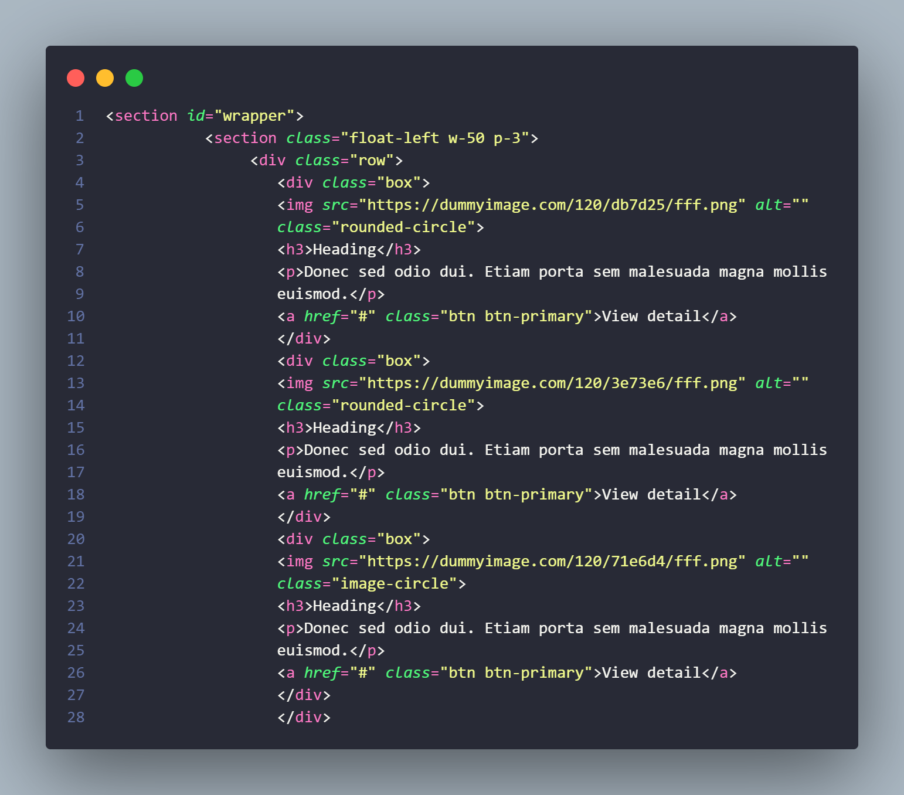

# HTML - CSS - BOOSTRAP

=========================================================================== 

&#128640 <b>NAMA : CHAERUL HIDAYAT</b>&#128640  
&#128640<b>NIM : 312210300</b>&#128640  
&#128640<b>Mata Kuliah : Pemrograman Web</b>&#128640  

===========================================================================  

# 1. Saya menggunskan Boostrap versi 4.5.2  

  

# 2. Saya membuat layout dan nav link  

 
Dan ini hasil nya  
  

# 3. Saya membuat isi Hello World  

 
Dan ini hasil nya  
  

# 4. Saya membuat article circle  

 
Dan ini hasil nya  
  

# 5. Saya Membuat Widget Header  

  
Dan ini hasil nya  
  

# 6. Saya membuat article box  

  
Dan ini hasil nya  
  

# 7. Saya membuat footer  

 
Dan ini hasil nya  
  
